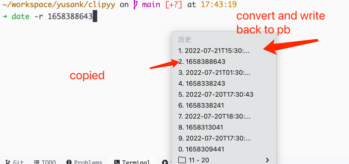

# clipyy

MacOS App written by golang.

core logic:

1. watch pasted board data
2. recognize time format or timestamp
3. convert data between time format and timestamp
4. write result to clipboard
5. show status in status bar

## Features

- support add own plugins
- support match custom regexp and handle it or write back to clipboard

## screenshots

